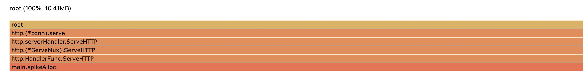

## How to test

1. change to the current gcheap directory
```
cd /path/to/gcheap/
```

2. compile
```
go build gcheap.go
```

3. start the sample http server with the gctrace enabled.
```
GODEBUG=gctrace=1 ./gcheap
```

4. start the rand allocation case
```
./rand.sh
```

the `/rand` api will allocation some memory and will be recycled soon,
the internal `heapMarked` will stay about 10 MB, and the GC Goal will stay about 21MB.

we can see the following gctrace log from stdout:
```
gc 28 @11.666s 0%: 0.17+0.19+0.017 ms clock, 2.0+0.085/0.19/0.13+0.20 ms cpu, 20->20->10 MB, 21 MB goal, 12 P
gc 29 @12.121s 0%: 0.065+0.21+0.015 ms clock, 0.78+0.11/0.23/0.13+0.18 ms cpu, 20->20->10 MB, 21 MB goal, 12 P
```

Also, we can see the following holmes log from /tmp/holmes.log:
```
[Holmes] NODUMP GCHeap, config_min : 10, config_diff : 20, config_abs : 40, config_max : 0, previous : [10 10 10 10 10 10 10 10 10 10], current: 10
```

Everything works well now.

5. memory spike
```bash
curl http://localhost:10024/spike
```

The `/spike` API will allocate 10 MB memory and keep for a while.

We can see the GC goal increased from the gctrace log:
```
gc 432 @191.430s 0%: 0.14+0.40+0.004 ms clock, 1.7+0.26/0.41/0.52+0.051 ms cpu, 21->22->19 MB, 22 MB goal, 12 P
gc 433 @192.079s 0%: 0.042+0.22+0.002 ms clock, 0.51+0.097/0.38/0.21+0.024 ms cpu, 37->37->10 MB, 38 MB goal, 12 P
```

And we see that we got two profiles from holmes log:
```
[2022-02-09 14:48:23.103][Holmes] pprof GCHeap, config_min : 10, config_diff : 20, config_abs : 40, config_max : 0, previous : [10 10 10 10 10 10 10 10 10 19], current: 19
[2022-02-09 14:48:23.751][Holmes] pprof GCHeap, config_min : 10, config_diff : 20, config_abs : 40, config_max : 0, previous : [10 10 10 10 10 10 10 10 10 19], current: 10
```

6. generate flamegraph

we will know what cause the GC goal increased exactly by using the following command.
(we got the profile name by timestamp that from holmes log)
```
go tool pprof -http=:8000 -base GCHeap.20220209144823.103.bin GCHeap.20220209144823.751.bin
```

It shows the reason for memory spike clearly.

