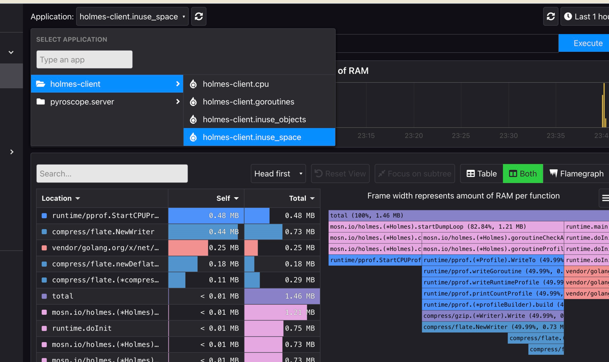

Enable holmes as pyroscope client and reports pprof 
event to pyroscope server.

note: CAN NOT set TextDump while using holmes as pyroscope client, 
bcs pyroscope need profile in proto format.

Step 1

``docker run -it -p 4040:4040 pyroscope/pyroscope:latest server``

open browser on [pyroscope admin page](http://localhost:4040/)

Step 2
run the script `start_client.sh` at `rideshare/`

Step 3
wait 15 seconds, refresh pyroscope admin page, select 
`holmes-client` on the `Application` box as the following.

